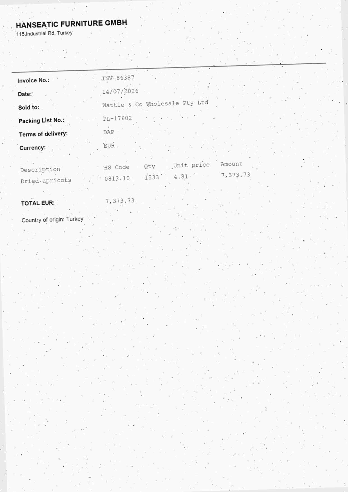

# P2 — Document intelligence on Azure: classify pages, extract fields, route to review

**Azure AI Document Intelligence + Azure OpenAI (gpt-4.1-mini), scored on a fixed answer key.**

| question | answer (from `results/`) |
|---|---|
| Real 1990s office scans, 16 classes, zero-shot: best page classifier? | **image → LLM: 67.5% accuracy** (macro-F1 66.5%). OCR → LLM 63.7%. Classical tf-idf baseline 43.8%. |
| Is "OCR first, then LLM" the cheap path? | **No. It cost 2.9× more** ($0.51 vs $0.18 for 252 pages) **and was less accurate.** OCR is the expensive call. |
| Typed fields from import-shipment pages? | **image → LLM 97.9%, layout → LLM 97.4%** of 606 fields. Regex on OCR text: 47%. |
| Can I trust extraction without a person checking everything? | **Two independent readers, human only on disagreement: 99.8% of auto-accepted fields correct, 4.3% of fields sent to review**, auto-accepted errors cut from 13 to 1. About 1.3¢ a page. |
| Azure's prebuilt invoice model? | **94% → 100% with one parameter.** All 6 misses were day/month swaps (`11/07/2026` read as 7 November). `locale="en-AU"` fixed every one. |

## Data

- **`rvl`**: 160 real scanned pages from the public [RVL-CDIP](https://adamharley.com/rvl-cdip/)
  sample, 10 per class, 16 classes (letter, memo, form, invoice, budget, scientific report…).
  Images aren't committed; `fetch` instructions are below.
- **`trade`**: 92 **synthetic** import-shipment pages generated by
  [`generate_trade_docs.py`](generate_trade_docs.py): 20 consignments, each with a commercial
  invoice, packing list and bill of lading plus 1–3 of certificate of origin, phytosanitary
  certificate and fumigation certificate. Every page is rendered as a noisy scan (rotation,
  blur, speckle, low-quality JPEG). A third have no printed title, and pages cross-reference
  each other ("Invoice No." on a packing list). Every company and number is invented, and
  every field value is known.
- A **separate** training split (RVL-CDIP train sample + 49 synthetic pages from a different
  seed) is used only to fit the classical baseline, so the baseline is never scored on pages
  it saw.



## Classification (`evalgate run doc-intelligence:classify`)

| system | real scans acc. | real scans macro-F1 | synthetic trade acc. | cost / 252 pages |
|---|---|---|---|---|
| majority *(baseline)* | 6.2% | 0.7% | 21.7% | $0 |
| tf-idf nearest-centroid on OCR *(baseline)* | 43.8% | 39.2% | 100% | $0.45 |
| OCR text → gpt-4.1-mini | 63.7% | 61.8% | 100% | $0.51 |
| page image → gpt-4.1-mini | 67.5% | 66.5% | 100% | **$0.18** |
| cascade: text, escalate to image when not "high" confidence (15.9% escalated) | **68.8%** | **67.5%** | 100% | $0.54 |

What it means:
- **The synthetic set saturated.** Every system, including the tf-idf baseline, scored 100%,
  untitled pages included, so it can't tell systems apart. I left the generator alone rather
  than make it harder until the LLM won, and the gate headline uses the real scans only.
- **The cascade isn't worth it here.** I built it expecting the text pass to be the cheap
  filter, but the text pass needs OCR, and OCR is most of the bill. Image-only is within
  1.3 points at a third of the cost.
- The real-scan errors are mostly genuinely ambiguous classes in this dataset: letter vs
  memo, budget vs invoice, presentation vs memo.

## Extraction (`evalgate run doc-intelligence:extract`)

The true document class picks the field schema, so extraction is scored on its own rather
than on top of classification errors. Values are compared after normalising case,
whitespace, thousands separators and date format.

| system | fields right (606) | pages with every field right |
|---|---|---|
| regex on OCR text *(baseline: one pattern per field, written from the field name)* | 47.4% | 0% |
| Document Intelligence layout (markdown) → gpt-4.1-mini, JSON schema output | 97.4% | 83.7% |
| page image → gpt-4.1-mini, JSON schema output | **97.9%** | **85.9%** |

The baseline fails because the OCR reading order separates labels from their values: the
value for "Currency:" turns up eleven lines later. The two LLM readers fail in **different**
ways:

- **layout → LLM**: scan speckle becomes punctuation inside identifiers (`INV-3.7060`,
  `MEDU48520.404`), and letterhead addresses get glued onto the seller name.
- **image → LLM**: O/0 confusion on monospaced IDs (`C0589528` for `CO589528`) in 9 of its 13
  misses.

## Review routing (`evalgate run doc-intelligence:review`)

Because the readers fail differently, agreement between them is informative. A field is
auto-accepted when both readers agree and goes to a person when they don't.

| system | auto-accepted fields correct | fields sent to review | wrong fields auto-accepted | pages needing no review |
|---|---|---|---|---|
| trust image → LLM, review nothing *(baseline)* | 97.9% | 0% | 13 | 100% |
| **two readers, review on disagreement** | **99.8%** | **4.3%** | **1** | 72.8% |

The gate requires precision to beat the single reader by at least 1 point and caps review at
10% of fields. The one error that got through was both readers turning the same speckle
into the same character: HS code `0904.11` read as `0904:11` on page B15-01. Agreement
can't catch a mistake both readers share. A format check (HS codes are `NNNN.NN`) would,
and it's the obvious next step.

## Azure prebuilt invoice model (side comparison, `compare_prebuilt_invoice.py`)

[`results/prebuilt_invoice.md`](results/prebuilt_invoice.md), over the 5 fields it has an
equivalent for, on the 20 invoices:

| system | fields right |
|---|---|
| prebuilt-invoice (default) | 94/100 |
| **prebuilt-invoice, `locale="en-AU"`** | **100/100** |
| layout → gpt-4.1-mini | 97/100 |
| image → gpt-4.1-mini | 99/100 |

All 6 default misses were dates with a day of 12 or less, read month-first. That's a silent
failure: the value is a valid date, it's just the wrong one. It would pass any schema check
and only an answer key catches it.

## Reproduce

```bash
evalgate run doc-intelligence:classify      # replay, $0, no images needed
evalgate run doc-intelligence:extract
evalgate run doc-intelligence:review
# live (bills Azure, ~$2.50 for everything):
python projects/doc-intelligence/generate_trade_docs.py
#   + download the RVL-CDIP sample parquet into data/raw/ (see suite.py docstring)
EVALGATE_MODE=record evalgate run doc-intelligence:classify
```

Total live spend for this project: **about $2.30** (see `../../spend/ledger.jsonl`).
